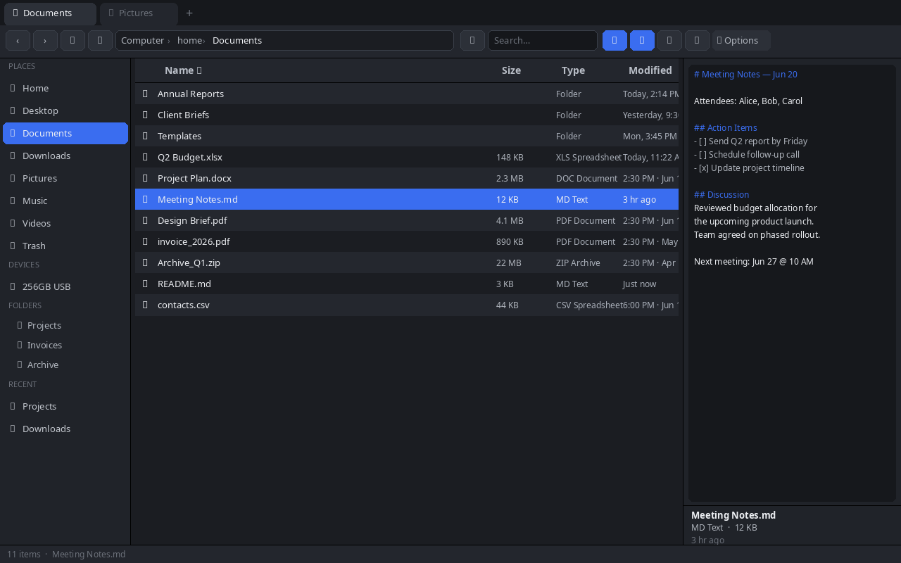
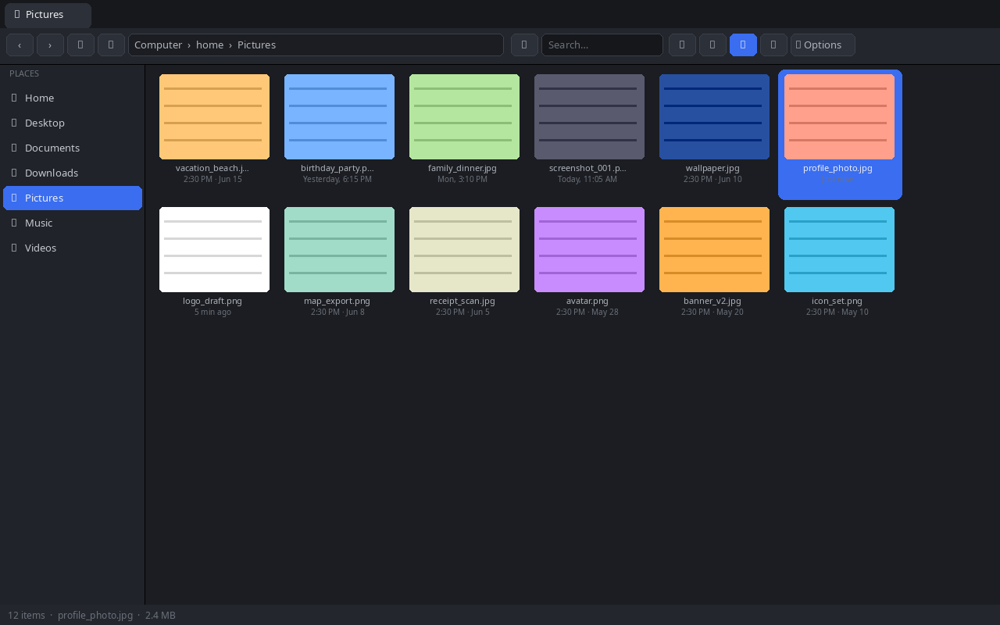
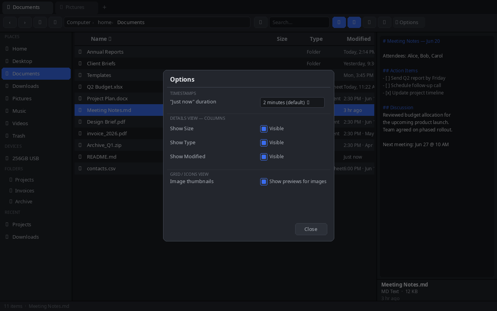

# Wayfinder

**A fast, native file manager for Linux** — built with Tauri 2, Svelte 5, and Rust.

Wayfinder replaces Dolphin, Nemo, and Nautilus with a single clean app: dark-themed, keyboard-driven, with a docked preview pane, Windows-style timestamps, image thumbnails, USB hotplug, tabs, and full file operations — all in a 13 MB binary with no Electron overhead.

---

## Screenshots

**Details view** — file list with preview pane, tabs, and breadcrumb navigation:



**Grid / Icons view** — image thumbnails with live relative timestamps:



**⚙ Options modal** — configure timestamps, column visibility, and thumbnails:



---

## Download

Grab the latest binary from the [**Releases**](https://github.com/LegendofZito/wayfinder/releases) page — no install required.

```bash
chmod +x wayfinder-linux-x86_64
./wayfinder-linux-x86_64
```

Or install the RPM on Fedora/RHEL:

```bash
sudo rpm -i Wayfinder-0.1.0-1.x86_64.rpm
```

---

## Requirements

- Linux (Wayland or X11)
- `xdg-utils` — for opening files with default apps
- `gio` / `glib2` — for Trash support
- `udisks2` — for mounting and ejecting drives
- A freedesktop icon theme (`breeze-icons`, `papirus-icon-theme`, etc.)

---

## Features

### Navigation

| Feature | Details |
|---------|---------|
| **Breadcrumb path bar** | Shows `Computer › home › folder` — click any segment to jump there |
| **Click to edit path** | Click the empty space to the right of the breadcrumbs to type a path directly |
| **Paste a path** | Right-click the path bar — if your clipboard has an absolute path (`/…`), navigates there instantly |
| **Back / Forward** | Full browser-style history per tab. `Backspace` = back, `Alt+←/→` = back/forward |
| **Up to parent** | `Alt+Up` or the ↑ toolbar button |
| **Home button** | ⌂ in the toolbar — jumps to your Home folder |
| **Address bar edit** | `Ctrl+L` or double-click the path bar — type any path, press Enter |
| **Refresh** | `F5` or the ⟳ toolbar button |
| **Type-ahead** | Start typing a filename — selection jumps to the first match |
| **Arrow key nav** | `↑`/`↓` to move selection, `Enter` to open |

---

### Tabs

| Feature | Details |
|---------|---------|
| **Multiple tabs** | `Ctrl+T` opens a new tab at the current folder |
| **Close tab** | `Ctrl+W` or click the × on the tab |
| **Switch tabs** | Click any tab |
| **Drop onto tab** | Drag files and drop onto a tab to move/copy them there |
| **Per-tab history** | Each tab keeps its own back/forward history independently |

---

### File Views

| Feature | Details |
|---------|---------|
| **Details view** | Table with Name, Size, Type, Modified — click column headers to sort |
| **Icons / Grid view** | Large icon grid — zoom with `Ctrl+scroll` |
| **Image thumbnails** | In grid view, actual image previews load automatically (up to 60 per folder). Toggle in ⚙ Options |
| **Sort** | Click any column header to sort ascending; click again for descending |
| **Folders first** | Directories always appear before files, regardless of sort |
| **Search / Filter** | Type in the search box to live-filter the current folder |
| **Hidden files** | Toggle with the checkbox at the bottom of the sidebar |
| **Icon zoom** | `Ctrl+scroll` in the file area to scale icons from 50% to 400% |

---

### Preview Pane

| Feature | Details |
|---------|---------|
| **Always-on preview** | Right pane shows the selected file — no popups needed |
| **Image preview** | Renders images up to 60 MB with zoom support |
| **Preview zoom** | `Ctrl+scroll` inside the preview pane to zoom in/out |
| **Text preview** | Text, code, Markdown, logs, JSON — shows content up to 256 KB |
| **Binary detection** | Files with binary content show a placeholder instead of garbled text |
| **File metadata** | Below the preview: name, type, size, modified date |
| **Toggle preview** | ▭ toolbar button or drag the splitter handle to resize |
| **Resizable pane** | Drag the splitter between file list and preview — size persists between sessions |

---

### File Operations

| Operation | How |
|-----------|-----|
| **Open** | Double-click or `Enter` |
| **Open With** | Right-click → Open With → hover to see app list flyout |
| **Copy** | `Ctrl+C` or right-click → Copy |
| **Cut** | `Ctrl+X` or right-click → Cut |
| **Paste** | `Ctrl+V` or right-click → Paste (in destination folder) |
| **Rename** | `F2` or right-click → Rename |
| **Delete to Trash** | `Delete` key or right-click → Move to Trash |
| **Permanent delete** | Right-click → Delete permanently (with confirmation dialog) |
| **New folder** | Right-click empty area → New Folder |
| **New file** | Right-click empty area → New File |
| **Empty Trash** | Navigate to Trash → right-click → Empty Trash |
| **Select all** | `Ctrl+A` |
| **Multi-select** | `Ctrl+click` to toggle, `Shift+click` to range-select |
| **Compress to ZIP** | Right-click selection → Compress to ZIP |
| **Extract archive** | Right-click a ZIP/TAR/TGZ → Extract Here |
| **Properties** | Right-click → Properties — shows size, permissions, dates, item count |
| **Open Terminal Here** | Right-click → Open Terminal Here |

---

### Drag & Drop

| Feature | Details |
|---------|---------|
| **Move** | Drag files onto a folder, sidebar place, or tab |
| **Copy** | Hold `Ctrl` while dropping — copies instead of moves |
| **Drop targets** | Works on folders in the file list, sidebar places, favorites, and tabs |
| **Visual feedback** | Drop targets highlight in blue while dragging over them |

---

### Sidebar

| Section | Details |
|---------|---------|
| **Favorites** | Pin any folder — right-click a place → Add to Favorites; right-click a favorite → Remove |
| **Places** | Home, Desktop, Documents, Downloads, Pictures, Music, Videos, Trash, Root — auto-detected at launch |
| **Devices** | All mounted drives and rclone/cloud mounts. Click to navigate; if unmounted, mounts on click |
| **Folders (Tree)** | Collapsible folder tree rooted at Home — click a folder row to expand and navigate |
| **Recent** | Last 12 folders visited, auto-tracked per session and saved across restarts |
| **Hidden files toggle** | Checkbox at the bottom of the sidebar |
| **Resizable sidebar** | Drag the splitter between sidebar and file list |

---

### Drives & USB

| Feature | Details |
|---------|---------|
| **USB hotplug** | Drives appear in the sidebar automatically when plugged in — no manual refresh |
| **Mount on click** | Unmounted drives are mounted when you click them |
| **Unmount** | Right-click a mounted drive → Unmount |
| **Eject (safe remove)** | Right-click a USB/removable drive → Eject — safe to remove |
| **Cloud / network mounts** | rclone mounts (Google Drive etc.) appear alongside local drives |

---

### Timestamps

Timestamps update live every minute — no refresh needed.

| Age | Display |
|-----|---------|
| < 2 minutes | **Just now** |
| 2–59 minutes | **5 min ago** |
| 1–12 hours | **3 hr ago** |
| Earlier today | **Today, 2:30 PM** |
| Yesterday | **Yesterday, 11:15 AM** |
| This week | **Mon, 9:45 AM** |
| This year | **Jun 3, 4:00 PM** |
| Older | **Jun 3, 2023, 4:00 PM** |

All times use a 12-hour clock tied to your system timezone.

---

### ⚙ Options

Click **⚙ Options** in the toolbar to configure:

| Setting | Default | What it does |
|---------|---------|--------------|
| **"Just now" duration** | 2 minutes | How long a newly modified file shows "Just now" before switching to relative time. Set to Off for exact timestamps always |
| **Show Size column** | On | Toggle the Size column in Details view |
| **Show Type column** | On | Toggle the Type column in Details view |
| **Show Modified column** | On | Toggle the Modified date column in Details view |
| **Image thumbnails** | On | Load real image previews in grid view. Turning off speeds up browsing large image folders |

All settings persist across restarts.

---

### Keyboard Shortcuts — Full Reference

#### Navigation
| Key | Action |
|-----|--------|
| `Backspace` | Go back in history |
| `Alt+←` | Go back |
| `Alt+→` | Go forward |
| `Alt+Up` | Go up to parent folder |
| `Ctrl+L` | Focus address bar (type any path) |
| `F5` | Refresh current folder |
| `Enter` | Open selected file or folder |
| `↑` / `↓` | Move selection up / down |
| `Escape` | Deselect all / close menus and dialogs |

#### Tabs
| Key | Action |
|-----|--------|
| `Ctrl+T` | New tab (opens at current folder) |
| `Ctrl+W` | Close current tab |

#### File Operations
| Key | Action |
|-----|--------|
| `Ctrl+C` | Copy selection |
| `Ctrl+X` | Cut selection |
| `Ctrl+V` | Paste |
| `Ctrl+A` | Select all |
| `F2` | Rename selected file |
| `Delete` | Move to Trash |

#### View
| Key | Action |
|-----|--------|
| `Ctrl+scroll` (file pane) | Zoom file icons in/out |
| `Ctrl+scroll` (preview pane) | Zoom preview image in/out |

#### Type-ahead
Start typing any letter — the selection jumps to the first file whose name starts with what you typed. Clears after 800 ms of no input.

---

### File Type Icons

Wayfinder uses your system's freedesktop icon theme to show per-type icons. Recognized types include:

- **Audio**: mp3, wav, flac, ogg, m4a, aac, opus, wma, aiff, alac
- **Video**: mp4, mkv, webm, mov, avi, wmv, m4v, mpg, mpeg, 3gp, flv
- **Image**: png, jpg, gif, bmp, webp, tiff, svg, ico, avif, heic
- **Documents**: pdf, doc/docx, odt, rtf, xls/xlsx, ods, ppt/pptx, odp
- **Archives**: zip, tar, gz, tgz, bz2, xz, 7z, rar, zst, cab
- **Code**: py, js, ts, tsx, jsx, rs, c, cpp, h, java, go, sh, bash, html, css, json, xml
- **Fonts**: ttf, otf, woff, woff2
- **Disk images**: iso, img, dmg
- **Packages**: rpm, deb, AppImage

---

### Persistence

Everything that matters is saved automatically:

| What | Saved |
|------|-------|
| Favorites | Yes — survives restarts |
| Recent folders | Yes — last 12, survives restarts |
| Sidebar width | Yes |
| Preview pane width | Yes |
| Preview pane visible | Yes |
| Icon zoom level | Yes |
| Column visibility | Yes |
| Thumbnail setting | Yes |
| "Just now" duration | Yes |

---

## Build from Source

Prerequisites: [Rust](https://rustup.rs), Node.js 20+, [Tauri 2 Linux deps](https://v2.tauri.app/start/prerequisites/).

```bash
git clone https://github.com/LegendofZito/wayfinder.git
cd wayfinder
npm install

# Dev mode (hot-reload)
npm run tauri dev

# Release binary
npm run tauri build -- --no-bundle
# → src-tauri/target/release/wayfinder

# RPM package (Fedora/RHEL)
npm run tauri build -- --bundles rpm

# DEB package (Ubuntu/Debian)
npm run tauri build -- --bundles deb
```

---

## License

© 2026 LegendofZito — All Rights Reserved.

Personal use is permitted. Modification, redistribution, and commercial use are prohibited without written permission. See [LICENSE](LICENSE) for full terms.
